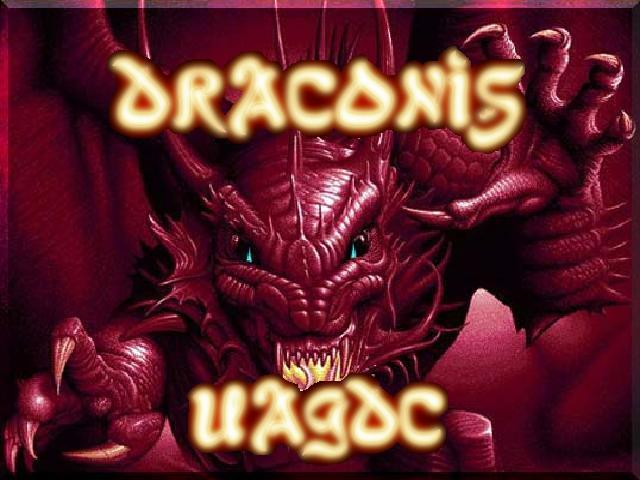

# Draconis
UAGDC 2006 MMORPG project

## About
In 2006 the University of Arkansas Game Development Club attempted to make a 2D MMORPG for their group project.  This repository contains the code and assets for that project.

* `client/` - client portion of MMO
* `server/` - server portion

Building and running the client requires SDL 1.2 libraries, as well as SDL\_TTF, SDL\_Mixer, SDL\_Image (+ libjpeg and libpng) and SDL\_Net.

## SECURITY ALERT
This project was coded by undergraduate students, who lacked knowledge of network programming and also did not have extensive C experience.  The server and client should be assumed vulnerable to buffer overflows, path bugs, TCP sniffing / MITM attacks, etc.  **No attempt will be made to patch security issues**.  Do not run this software unless you fully trust the users who will play on it.  Think very hard before using any code from this in your own projects.
